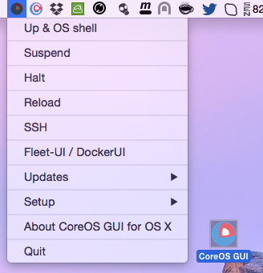

CoreOS-Vagrant GUI for OS X
============================

CoreOS-Vagrant GUI for Mac OS X is a Mac Status bar App which works like a wrapper around the [coreos-vagrant](https://github.com/coreos/coreos-vagrant) command line tool. It supports only a standalone CoreOS VM, cluster one is in the works [CoreOS-Vagrant Cluster GUI](https://github.com/rimusz/coreos-osx-gui-cluster).
 
[CoreOS](https://coreos.com) is a Linux distribution made specifically to run [Docker](https://www.docker.io/) containers.
[CoreOS-Vagrant](https://github.com/coreos/coreos-vagrant) is made to run on VirtualBox and VMWare VMs.



Download
--------
Head over to the [Releases Page](https://github.com/rimusz/coreos-osx-gui/releases) to grab the latest ZIP file.


How to install
----------

Required software
* [VirtualBox for Mac OS X hosts](https://www.virtualbox.org/wiki/Downloads)
* [Vagrant for Mac OS X](http://www.vagrantup.com/downloads.html)
* [iTerm 2](http://www.iterm2.com/#/section/downloads)

* Download ````CoreOS Vagrant OSX GUI latest.zip```` from the [Releases Page](https://github.com/rimusz/coreos-osx-gui/releases) and unzip it.
* Start the ````CoreOS Vagrant OSX GUI```` and from menu ````Setup```` choose ````Initial setup of CoreOS-Vagrant```` 
* The install will do the following:
````
1) All dependent files/folders will be put under "coreos-osx" folder in the user's home folder e.g /Users/someuser/coreos-osx
2) Will clone latest coreos-vagrant from git
3) user-data file will have fleet, etcd, Docker Socket for the API and DockerUI enabled
4) docker 2375 port will be set for docker OS X client to work properly
5) Will set VM IP to 172.17.8.99 for DockerUI to properly open in a default web browser
6) Will download and install fleet, etcd and docker OS X clients to ~/coreos-osx/bin/
7) Will download latest vagrant VBox and run vagrant up to initialise VM
8) Will forward 2375 (docker) and 9000 (DockerUI) from host to vagrant VM.
9) By default alpha release channel is set.
````

How it works
------------

Just start ````CoreOS Vagrant OSX GUI```` application and you will find a small icon with the CoreOS logo in the Status Bar.
For now it only supports a standalone CoreOS VM, cluster support might come at some stage later one.

* There you can ````Up````, ````Suspend````, ````Halt````, ````Reload```` CoreOS vagrant VM
* Under ````Up & OS shell```` OS Shell will be opened when ````vagrant up```` finishes and it will have such environment set:
````
DOCKER_HOST=tcp://127.0.0.1:2375
FLEETCTL_TUNNEL=127.0.0.1:2222
Path to ~/coreos-osx/bin where docker, etcdclt and fleetctl binaries are stored
ssh-add ~/.vagrant.d/insecure_private_key for the fleetctl tunnel to work properly
```` 
* ````Check for updates```` will update docker, etcdclt and fleetctl OS X clients to the same versions as CoreOS VM runs. It will store downloads from github ````coreos-vagrant```` in ````~/coreos-osx/github```` folder, it will not overwrite user's ````Vagrantfile, config.rb and users-data```` files.
* ````SSH```` will open VM shell
* [DockerUI](https://github.com/crosbymichael/dockerui) will show all running containers and etc (it might take a bit of a time after install for it to work as it needs to download it's image)

TO-DOs
------

* Add Destroy VM, change CoreOS release channel and CoreOS-Vagrant remove options

Other links
-----------
Also you might like my other [boot2docker GUI for OS X](https://github.com/rimusz/boot2docker-gui-osx) project for [boot2docker](https://github.com/boot2docker/boot2docker),
as I use both projects depending on the work I need to do.


