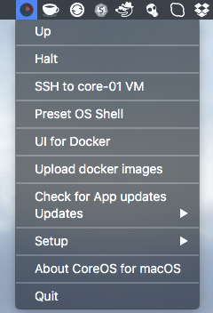

CoreOS VM for macOS 
========================

**CoreOS VM for macOS** (coreos-machine) is a Mac Status bar App which works like a wrapper around the [corectl](https://github.com/TheNewNormal/corectl) command line tool (it makes easier to control [xhyve](https://github.com/xhyve-xyz/xhyve) based VMs). 

The best use case of this App is to allow to build/test [Docker](https://www.docker.com) and [rkt](https://coreos.com/rkt/) images localy.
You can use included [Docker Registry v2](https://github.com/docker/distribution) (Go based and compiled for OS X) to store
your Docker images and share with Kubernetes Apps for OS X: [Kube-solo](https://github.com/TheNewNormal/kube-solo-osx) and [Kube-Cluster](https://github.com/TheNewNormal/kube-cluster-osx)




How to install CoreOS VM for macOS
----------

**Requirements**
 -----------
  - **macOS 10.10.3** Yosemite or later 
  - Mac 2010 or later for this to work.


####Download:
* Download `CoreOS OSX latest.dmg` from the [Releases Page](https://github.com/TheNewNormal/coreos-osx/releases)

###Install:

Open downloaded `dmg` file and drag the App e.g. to your Desktop. Start the `CoreOS OSX` and `Initial setup of CoreOS OSX` will run.

**TL;DR**

- App's files are installed to `~/coreos-osx` folder
- CoreOS ISO files are stored under `~/.coreos` folder
- Docker registry runs on `192.168.64.1:5000` and images are stored under `~/coreos-osx/registry`
- Mac user home folder is automaticly mounted to VM: `/Users/my_user`:`/Users/my_user`
- OS X `docker` client is installed to `~/coreos-osx/bin` and preset in `OS shell` to be used from there

**The install will do the following:**

- All dependent files/folders will be put under `coreos-osx` folder in the user's home folder e.g /Users/someuser/coreos-osx
- Mac user home folder is automaticly mounted to VM: `/Users/my_user` can be accessed on VM via the same `/Users/my_user`, it is very handy for using docker mounted volumes 
- User's Mac password will be stored in `OS X Keychain`, it will be used to pass to `sudo` command which needs to be used starting the VM, this allows to avoid using `sudo` for `corectl` to start a VM. 
- ISO images are stored under `~/.coreos/images`
That allows to share the same images between different `corectl` based Apps and also speeds up this App VMs reinstall
- user-data file will have Docker Socket for the API enabled
- Will download latest CoreOS ISO image and run `corectl` to initialise VM with docker 2375 port pre-set for docker OS X client
- Will download and install `docker` OS X client to ~/coreos-osx/bin/
- A small shell script `rkt` will be installed to ~/coreos-osx/bin/ which allows to call via ssh remote `rkt` binary on CoreOS VM
- A small shell script `etcdctl` will be installed to ~/coreos-osx/bin/ which allows to call via ssh remote `etcdctl` binary on CoreOS VM
- `docker-exec` script (docker exec -it $1 bash -c 'export TERM=xterm && bash') will be installed 
 into ~/coreos-osx/bin/ too, which allows to enter container with just a simple command:
 docker-exec container_name 
- Also `docker2aci` binary will be installed to ~/coreos-osx/bin/, which allows to convert docker images to `rkt` aci images
- Will install [UI for Docker](https://github.com/kevana/ui-for-docker) via unit files
- Via assigned static IP (it will be shown in first boot and will survive VM's reboots) you can access any port on CoreOS VM
- user-data file enables docker flag `--insecure-registry` to access insecure registries.
- Persistent disk `data.img` will be created and mounted to `/data` for these mount binds:

```
/data/var/lib/docker -> /var/lib/docker
/data/var/lib/rkt -> /var/lib/rkt
/data/var/lib/etcd2 -> /var/lib/etcd2
/data/opt/bin -> /opt/bin
```


How it works
------------

Just start `CoreOS OSX` application and you will find a small icon with the CoreOS logo in the Status Bar.

* There you can `Up`, `Halt`, `Reload` CoreOS VM
* `SSH to core-01` will open VM shell
* Under `Up` OS Shell will be opened when VM boot finishes up and it will have such environment pre-set:

```
DOCKER_HOST=tcp://192.168.64.xxx:2375
ETCDCTL_PEERS=http://192.168.64.xxx:2379
```
```
Path to `~/coreos-osx/bin` where docker binary, rkt, etcdclt 
and docker-exec shell scripts are stored
```

* `OS Shell` opens OS Shell with the same enviroment preset as `Up`
* `Updates/Check for update of docker OS X client` will update fleet and docker OS X clients to the same versions as CoreOS VM runs.
* `Updates/Fetch latest CoreOS ISO` will download the lasted CoreOS ISO file for the currently set release channel. 
* [UI for Docker](https://github.com/kevana/ui-for-docker) will show up all running containers and etc
* You can upload your saved/exported docker images place in `~/coreos-osx/docker_images` folder via `Upload docker images`
* Local Docker Registry v2 (Go based and compiled for  OS X) is running on `192.168.64.1:5000`, which gets started/stopped on each VM Up/Halt.
* This App has as much automation as possible to make easier to use CoreOS on OS X, e.g. you can change CoreOS release channel and reload VM as `root` persistant disk for VM will be created and mounted to `/` so data will survive VM reboots.


Credits
-----------
* To [António Meireles](https://github.com/AntonioMeireles) for his awesome [corectl](https://github.com/TheNewNormal/corectl) tool to easily control [xhyve](https://github.com/xhyve-xyz/xhyve)
* To [Michael Steil](https://github.com/mist64) for the awesome [xhyve](https://github.com/mist64/xhyve) lightweight OS X virtualization solution
* To Kelsey Hightower for [Docker Registry OS X Setup Guide](https://github.com/kelseyhightower/docker-registry-osx-setup-guide).


Other CoreOS VM based Apps
-----------
* Cluster one CoreOS VM App can be found here [CoreOS Cluster for macOS](https://github.com/rimusz/coreos-osx-cluster).
* Kubernetes Solo Cluster VM App (corectl based) can be found here [Kube Solo for macOS](https://github.com/TheNewNormal/kube-solo-osx).
* Kubernetes Cluster one CoreOS VM App can be found here [CoreOS Kubernetes Cluster for macOS](https://github.com/rimusz/coreos-osx-kubernetes-cluster).

