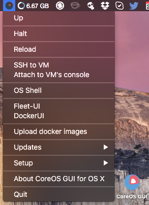

CoreOS VM GUI for OS X
========================

**CoreOS VM GUI for OS X** is a Mac Status bar App which works like a wrapper around the [coreos-xhyve](https://github.com/coreos/coreos-xhyve) command line tool. It includes Go based local [Docker Registry](https://github.com/docker/distribution) v2 which is based on Kelsey Hightower [Docker Registry OS X Setup Guide](https://github.com/kelseyhightower/docker-registry-osx-setup-guide).

It supports only a standalone CoreOS VM, cluster one (Vagrant based) is at [CoreOS Cluster GUI for OS X](https://github.com/rimusz/coreos-osx-gui-cluster).

**New:** from v1.0.0 it is now based on [coreos-xhyve](https://github.com/coreos/coreos-xhyve), that allows to have no dependencies on VirtualBox and Vagrant anymore and runs VM with just a single binary of [xhyve](https://github.com/mist64/xhyve).




How to install CoreOS VM GUI for OS X
----------

**Requirements**
 -----------
  - OS X 10.10.3 Yosemite or later 
  - Mac 2010 or later for this to work.
  - If you want to use this App with any other VirtualBox based VM, you need to use newest versions of VirtualBox 4.3.x or 5.0.x.

####Required software:
* [iTerm 2](http://www.iterm2.com/#/section/downloads) must be installed on the OS X for the App to be able to work.

####Download:
* Download `CoreOS OSX GUI  latest.dmg` from the [Releases Page](https://github.com/rimusz/coreos-osx-gui/releases), open it and drag the App e.g. to your Desktop.

###Install:

Start the `CoreOS OSX GUI ` and from menu `Setup` choose `Initial setup of CoreOS OSX GUI ` 
and the install will do the following:


- All dependent files/folders will be put under "coreos-osx" folder in the user's home folder e.g /Users/someuser/coreos-osx
- User's Mac password will be stored in `/Users/someuser/coreos-osx/.env/password` and encrypted with `base64` and set to `600`, it will be used to pass to `sudo` command which needs to be used starting VM with xhyve, this allows to avoid using `sudo` for `xhyve` to start a VM. 
- ISO images are stored under `~/.coreos-xhyve/imgs` and symlinked to it from `~/coreos-osx/imgs`
That allows to share the same images between different coreos-xhyve Apps and also speeds up this App's reinstall
- user-data file will have fleet, etcd, and Docker Socket for the API enabled
- Will download latest CoreOS ISO image and run `xhyve` to initialise VM with docker 2375 port pre-set for docker OS X client
- Will download and install `fleetctl` and `docker` OS X clients to ~/coreos-osx/bin/
- A small shell script `rkt` will be installed to ~/coreos-osx/bin/ which allows to call via ssh remote `rkt` binary on CoreOS VM
- A small shell script `etcdctl` will be installed to ~/coreos-osx/bin/ which allows to call via ssh remote `etcdctl` binary on CoreOS VM
- `docker-exec` script (docker exec -it $1 bash -c 'export TERM=xterm && bash') will be installed 
 into ~/coreos-osx/bin/ too, which allows to enter container with just a simple command:
 docker-exec container_name 
- Also `docker2aci` binary will be installed to ~/coreos-osx/bin/, which allows to convert docker images to `rkt` aci images
- Will install [Fleet-UI](http://fleetui.com) and [DockerUI](https://github.com/crosbymichael/dockerui) via unit files
- Via assigned static IP (it will be shown in first boot and will survive VM's reboots) you can access any port on CoreOS VM
- user-data file enables docker flag `--insecure-registry` to access insecure registries.
- Root persistant disk will be created and mounted to `/` so data will survive VM reboots. 


How it works
------------

Just start `CoreOS OSX GUI ` application and you will find a small icon with the CoreOS logo with `h`in the Status Bar.

* There you can `Up`, `Halt`, `Reload` CoreOS VM
* `SSH to core-01` (vagrant ssh) will open VM shell
* `Attach to VM's console` will open console
* Under `Up` OS Shell will be opened when VM boot finishes up and it will have such environment pre-set:

````
DOCKER_HOST=tcp://192.168.64.xxx:2375
ETCDCTL_PEERS=http://192.168.64.xxx:2379
FLEETCTL_ENDPOINT=http://192.168.64.xxx:2379
FLEETCTL_DRIVER=etcd
Path to ~/coreos-osx/bin where docker and fleetctl binaries, rkt, etcdclt 
and docker-exec shell scripts are stored
```` 
Also under 'Up" local webserver `python -m SimpleHTTPServer 18000` serves customized local user-data.

* `OS Shell` opens OS Shell with the same enviroment preset as `Up`
* `Updates/Check updates for OS X fleetctl and docker clients` will update fleet and docker OS X clients to the same versions as CoreOS VM runs.
* `Updates/Fetch latest CoreOS ISO` will download the lasted CoreOS ISO file for the currently set release channel. 
* [Fleet-UI](http://fleetui.com) dashboard will show running `fleet` units and etc
* [DockerUI](https://github.com/crosbymichael/dockerui) will show all running containers and etc
* Put your fleet units into `~/coreos-osx/my_fleet` folder and they will be automaticly started on each VM boot.
* You can upload your saved/exported docker images place in `~/coreos-osx/docker_images` folder via `Upload docker images`
* Local Docker Registry v2 (Go based and compiled for  OS X) is running on `192.168.64.1:5000`, which gets started/stopped on each VM Up/Halt.
* This App has as much automation as possible to make easier to use CoreOS on OS X, e.g. you can change CoreOS release channel and reload VM as `root` persistant disk for VM will be created and mounted to `/` so data will survive VM reboots.

To-dos
-----------
* Mount /Users folder via nfs to CoreOS VM

Credits
-----------
* To [Michael Steil](https://github.com/mist64) for the awesome [xhyve](https://github.com/mist64/xhyve) lightweight OS X virtualization solution
* To CoreOS team for [coreos-xhyve](https://github.com/coreos/coreos-xhyve) version
* To [Antonio Meireles](https://github.com/AntonioMeireles) for his awesome tweaks spree to improve coreos-xhyve

Other CoreOS VM based Apps
-----------
* Cluster one CoreOS VM App can be found here [CoreOS Cluster GUI for OSX](https://github.com/rimusz/coreos-osx-gui-cluster).
* A Kubernetes Solo Cluster VM App can be found here [Kube Solo](https://github.com/rimusz/kube-solo-osx).
* A Kubernetes Solo Vagrant based Cluster VM App can be found here [CoreOS-Vagrant Kubernetes Solo GUI](https://github.com/rimusz/coreos-osx-gui-kubernetes-solo)
* Kubernetes Cluster one CoreOS VM App can be found here [CoreOS Kubernetes Cluster GUI for OSX ](https://github.com/rimusz/coreos-osx-gui-kubernetes-cluster).
